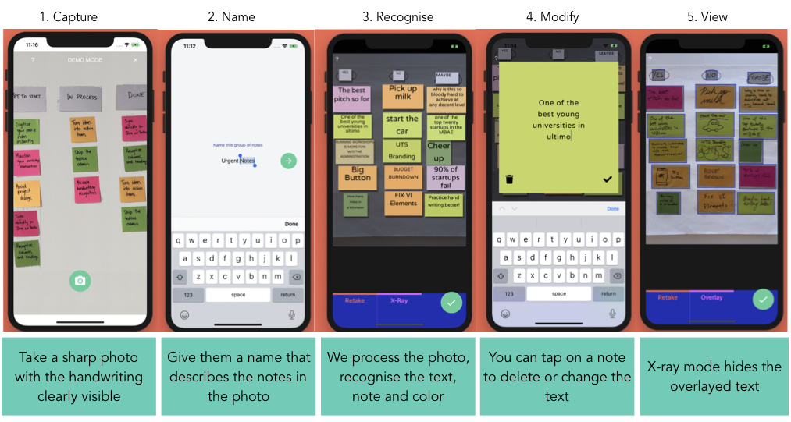
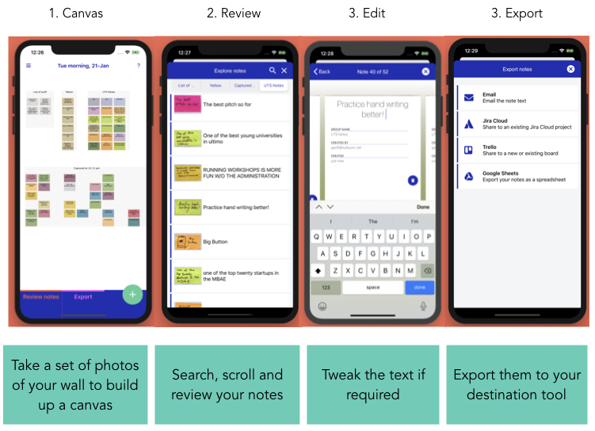
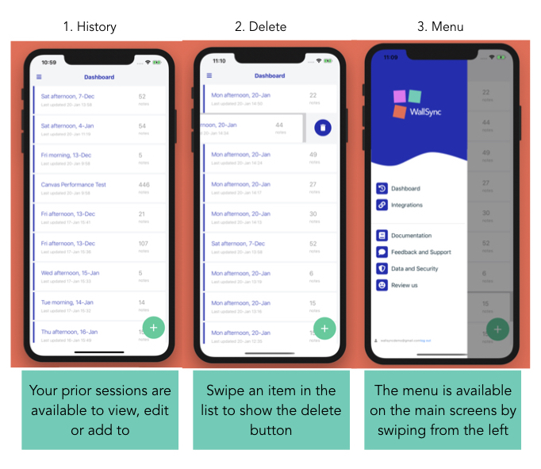

## WallSync Capture Documentation

---

### Contents {#content}
<!-- - [About](#about)
- [Create account](#create-account)
- [Verify email](#verify-email)
- [Capture mode](#capture-mode)
  - [Capturing sticky notes](#capture-mode-sticky-notes)
  - [Capturing whiteboard/ notebook notes](#capture-mode-handrwritten-notes)
- [How to capture images](#image-capture)
  - [Columns](#image-capture-columns)
  - [Groups](#image-capture-groups)
  - [Lists](#image-capture-lists)
  - [Text Boxes](#image-capture-boxes)
- [Organise and edit](#organise)
- [Settings](#settings)
- [Export](#export)
- [FAQs](#faqs)
- [Contact us](#contact)
- [Feedback](#feedback) -->

---

## About

The WallSync Capture mobile app allows you to quickly transform handwritten sticky notes, lists and text boxes into your digital tools.

You can download the app via the links below:

**iTunes App Store:**  [Download WallSync Capture for iPhone](https://itunes.apple.com/au/app/workshop-capture-for-post-its/id1348284502)

**Google Play:**  [Download WallSync Capture for Android](https://play.google.com/store/apps/details?id=net.wallsync.wscapture)

## The Capture flow
{:width="90%"}
#### Tips for taking photos
To get the best results, follow these steps:

- Take multiple photos if you have lots of notes to give us the best chance of getting 100% accurate handwriting recognition
- Write as neatly as you can - if a human can’t read it, neither can a computer (yet)!
- If using sticky notes, try to arrange them neatly. Avoid overlapping notes.
- Take clear images where the handwriting is clearly visible.
- Ensure you have good lighting in the room.
- Use dark pens, whiteboard markers or sharpies.
- Contrast the colour between the wall and the sticky notes or index cards (i.e. pink sticky notes on a white wall)

## The Canvas - where organisation happens
{:width="80%"}

## The Dashboard
{:width="80%"}

## Using the canvas to organise notes {#canvas}

The Wallsync canvas is where you can 
1. organise your notes into categories
2. add multiple photos to build up a complete story of a workshop or meeting

### Long-press to rearrange a note

If you'd like to rearrange the position of a note or move it to a different category, press down on it for a second and you'll be able to drag it to a different position

<video width="200" class="doc-video"  muted playsinline autoplay preload="none" loop>
    <source src="videos/help_longpress_to_move.mp4" type="video/mp4">
</video>

### Double-tap to edit a note

In the canvas view, double tapping on a note will open the edit note screen allowing you to edit the note text or delete it

<video width="200" class="doc-video"  muted playsinline autoplay preload="none" loop>
    <source src="videos/help_double_click_to_edit.mp4" type="video/mp4">
</video>

## Split by column

<video width="200" class="doc-video"  muted playsinline autoplay preload="none" loop>
    <source src="videos/help_split.mp4" type="video/mp4">
</video>

