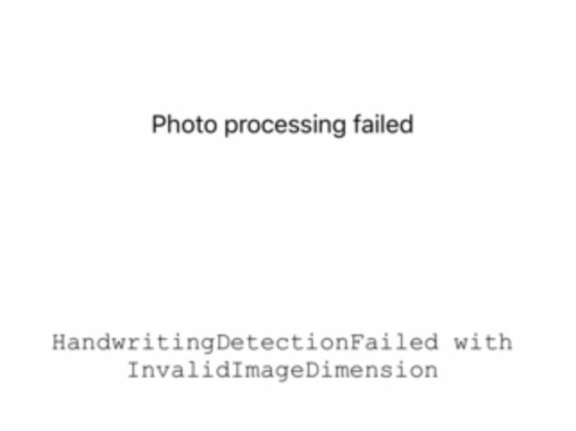
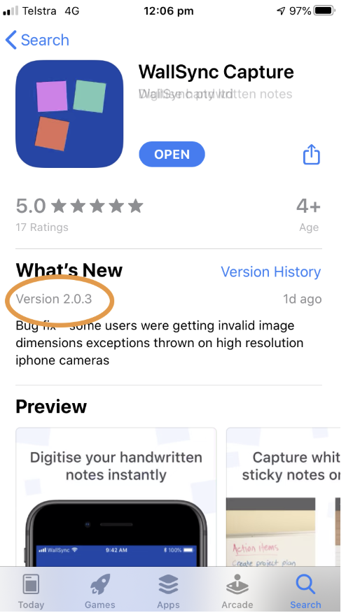

 

# Critical fix: InvalidImageDimensions
  
We have just released a new version to fix an issue with processing large images from iPhones.    If you saw this message it was the fix for that!

{:style="width:50%"}

**NOTE: You might need to force an update by clicking on your profile icon in the iOS app store and selecting Update Now.**

{:style="width:40%"}

I'd love to hear how you're going!  If you have a few minutes, shoot me a line at geoffbullen@wallsync.net!

## [Back to WallSync](https://link.wallsync.app/welcome1)